# Documento de Sustentación - Taller: Actualizar y Eliminar Tareas (CampusTasks)

---

## 1. Datos Generales

* **Integrantes:**
  * Simón David Tarazona Melo — Código: `202459421` (`simon.tarazona@correounivalle.edu.co`)
  * Karen Andrea Sanabria Gonzalez — Código: `202459413` (`karen.sanabria@correounivalle.edu.co`)
  * Angel Nicolás Castañeda Valencia — Código: `202459426` (`castaneda.angel@correounivalle.edu.co`)
* **Fecha:** 5 de octubre de 2026
* **Nombre de la Rama:** `taller/actualizar-eliminar-tareas-simon-kSanabria-NicoCastañeda`
* **Repositorio Remoto:** `git@github.com:TevenV27/campus-task.git`

---

## 2. Puesta en Marcha

### 2.1 Instalación y Verificación de Node.js
Se verificó la instalación de Node.js y npm en el sistema:
```bash
node -v   # Versión instalada en el entorno (v22.x/v24.x)
npm -v    # Versión del gestor de paquetes
```

### 2.2 Instalación de PostgreSQL y Creación de la Base de Datos
1. Se inició el servicio del servidor PostgreSQL local en el puerto `5432`.
2. Se accedió a la consola interactiva mediante `psql`:
   ```bash
   psql -U postgres -h 127.0.0.1 -p 5432 -d postgres
   ```
3. Se creó la base de datos `campus_tasks` y la tabla requerida:
   ```sql
   CREATE DATABASE campus_tasks;
   \c campus_tasks
   CREATE TABLE tareas (
     id SERIAL PRIMARY KEY,
     titulo TEXT NOT NULL
   );
   INSERT INTO tareas (titulo) VALUES
     ('Leer la guía de la clase 2'),
     ('Preparar el entorno de desarrollo');
   ```
4. Se comprobó la inserción inicial con `SELECT * FROM tareas;`, retornando las 2 filas esperadas.

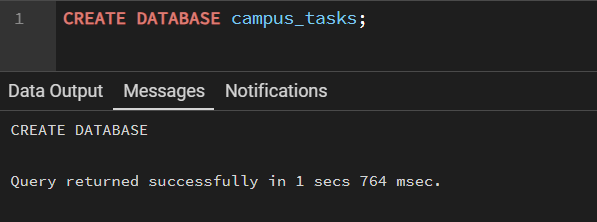
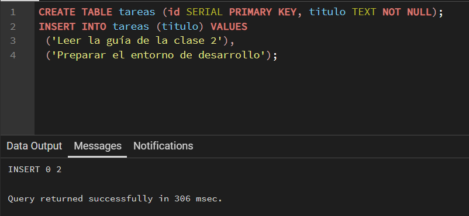

### 2.3 Configuración de Variables de Entorno (`backend/.env`)
Siguiendo las instrucciones del taller, se configuró el archivo `backend/.env` (el cual se encuentra debidamente ignorado por Git en `.gitignore` para no exponer credenciales):
```env
DB_HOST=127.0.0.1
DB_PORT=5432
DB_USER=postgres
DB_PASSWORD=****
DB_NAME=campus_tasks
```
> **Nota de seguridad:** El archivo `.env` nunca se versiona en el repositorio.

### 2.4 Arranque y Comprobación del Backend y Frontend
* **Backend:**
  ```bash
  cd backend
  npm ci
  npm run start:dev
  ```
  Comprobación: Al hacer una petición `GET http://localhost:3000/tareas`, el servidor responde con status `200 OK` y el JSON:
  ```json
  [
    { "id": 1, "titulo": "Leer la guía de la clase 2" },
    { "id": 2, "titulo": "Preparar el entorno de desarrollo" }
  ]
  ```

  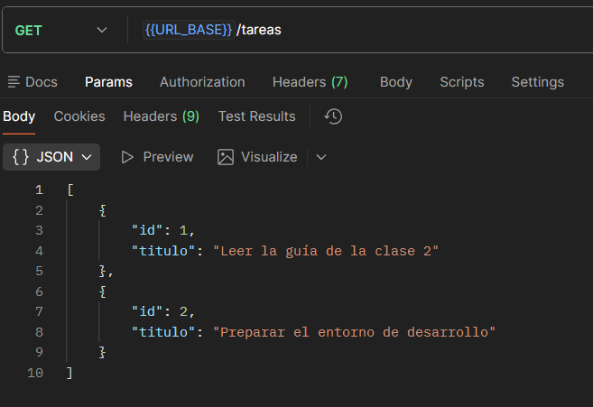

* **Frontend:**
  ```bash
  cd frontend
  npm ci
  npm start
  ```
  Comprobación: En `http://localhost:4200`, la aplicación renderiza las tareas iniciales y permite agregar nuevas tareas mediante el input y el botón **Agregar**.

  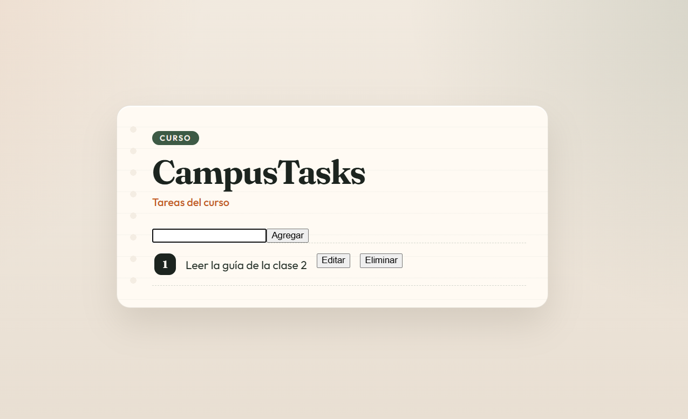
  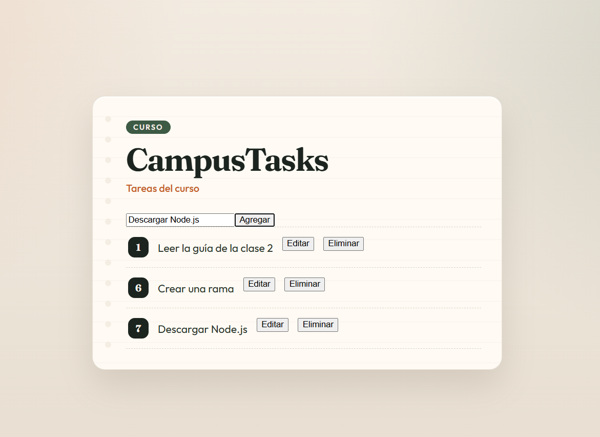

---

## 3. Lectura y Comprensión de las Pruebas de Ejemplo

Antes de escribir código nuevo, se analizaron los archivos de pruebas base del proyecto para comprender los patrones arquitectónicos y de prueba:

### 3.1 `backend/src/tareas/tareas.service.spec.ts` (Pruebas Unitarias)
* **Objetivo:** Verificar la lógica interna de los métodos del servicio `TareasService` de forma aislada, sin interactuar con la red ni con una base de datos real.
* **Patrón Preparar - Ejecutar - Verificar:**
  1. *Preparar:* Se crea un mock de `DatabaseService` utilizando `jest.fn()` para simular el método `query`. Se define el valor simulado que retornará la consulta con `query.mockResolvedValue({ rows: [...] })`.
  2. *Ejecutar:* Se invoca el método correspondiente del servicio (`service.listar()` o `service.crear(...)`).
  3. *Verificar:* Se asegura con `expect(query).toHaveBeenCalledWith(sql, params)` que la sentencia SQL sea la adecuada y que los parámetros posicionales coincidan, comprobando además el valor retornado.

### 3.2 `backend/src/tareas/tareas.integration.spec.ts` (Pruebas de Integración)
* **Objetivo:** Verificar el ciclo de vida completo de la petición HTTP a través del controlador `TareasController` y el servicio, comprobando enrutamiento, códigos de estado HTTP y serialización JSON.
* **Patrón:**
  1. *Preparar:* Se instancia una aplicación NestJS de prueba con `Test.createTestingModule` proveyendo el controlador y el mock de `DatabaseService`.
  2. *Ejecutar:* Se simula la petición HTTP utilizando `supertest` (`request(app.getHttpServer()).get(...)` o `.post(...)`).
  3. *Verificar:* Se valida el código de respuesta HTTP (`expect(200)` o `expect(201)`), la estructura y contenido del JSON de respuesta, y que el mock de base de datos haya recibido la consulta y argumentos correctos.

### 3.3 `frontend/src/components/tareas/tareas.component.spec.ts` (Pruebas de Componente)
* **Objetivo:** Probar el comportamiento del componente Angular `TareasComponent` en el DOM sin levantar el servidor backend.
* **Patrón:**
  1. *Preparar:* Se crea un SpyObj de Jasmine (`jasmine.createSpyObj('TareasService', [...])`) simulando las respuestas reactivas con `of(...)`. Se inicializa el fixture con `TestBed.createComponent`.
  2. *Ejecutar:* Se interactúa con los elementos del DOM (hacer clic en botones con `.click()`, modificar valores de inputs). Se llama a `fixture.detectChanges()` para reflejar el ciclo de detección de cambios de Angular.
  3. *Verificar:* Se valida que los métodos del servicio se hayan llamado con los argumentos correctos y que la vista se haya actualizado apropiadamente (agregando, modificando o eliminando nodos del DOM).

---

## 4. Implementación

### 4.1 Backend

#### Métodos agregados en `TareasService` (`backend/src/tareas/tareas.service.ts`)
Se implementaron los métodos `actualizar` y `eliminar` respetando las firmas y contratos exigidos:

```typescript
async actualizar(id: number, titulo: string): Promise<Tarea> {
  const resultado = await this.db.query<Tarea>(
    'UPDATE tareas SET titulo = $1 WHERE id = $2 RETURNING id, titulo',
    [titulo, id],
  );
  return resultado.rows[0];
}

async eliminar(id: number): Promise<Tarea> {
  const resultado = await this.db.query<Tarea>(
    'DELETE FROM tareas WHERE id = $1 RETURNING id, titulo',
    [id],
  );
  return resultado.rows[0];
}
```

* **Consultas parametrizadas:** Se utilizaron placeholders posicionales (`$1`, `$2`), evitando concatenaciones de cadenas que introducirían vulnerabilidades de inyección SQL (SQL Injection).

#### Rutas agregadas en `TareasController` (`backend/src/tareas/tareas.controller.ts`)
```typescript
@Patch(':id')
async actualizar(
  @Param('id', ParseIntPipe) id: number,
  @Body('titulo') titulo: string,
): Promise<Tarea> {
  const tarea = await this.tareasService.actualizar(id, titulo);
  if (!tarea) {
    throw new NotFoundException(`No existe la tarea ${id}`);
  }
  return tarea;
}

@Delete(':id')
async eliminar(@Param('id') id: string) {
  const tarea = await this.tareasService.eliminar(Number(id));
  if (!tarea) {
    throw new NotFoundException(`No existe la tarea ${id}`);
  }
  return tarea; 
}
```

#### Justificación de Decisiones de Diseño:
1. **Conversión del parámetro `:id` (string a number):**
   * En `PATCH /tareas/:id`, se utilizó el pipe de validación y transformación nativo de NestJS `ParseIntPipe`. Esto garantiza que si el cliente envía un identificador no numérico (por ejemplo `/tareas/abc`), NestJS automáticamente rechaza la solicitud con un código HTTP `400 Bad Request` antes de invocar la lógica del servicio.
   * En `DELETE /tareas/:id`, se realizó la conversión explícita con `Number(id)`, garantizando que el parámetro que viaja a la base de datos sea de tipo numérico primitivo y no una cadena de texto.
2. **Detección de recurso inexistente y respuesta 404:**
   * Tanto la sentencia `UPDATE` como `DELETE` utilizan la cláusula `RETURNING id, titulo`. Si la tarea con el `id` especificado no existe en la base de datos, PostgreSQL no afecta ninguna fila y `resultado.rows` retorna un arreglo vacío `[]`.
   * En consecuencia, `resultado.rows[0]` resulta en `undefined`.
   * En el controlador, evaluamos `if (!tarea)` y lanzamos un `NotFoundException` de NestJS, lo cual se traduce de forma limpia y estándar en una respuesta HTTP `404 Not Found`.

##### Evidencias de Ejecución (Peticiones DELETE 200 y 404):
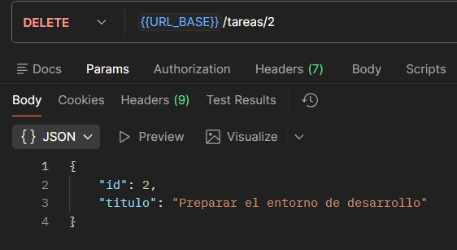
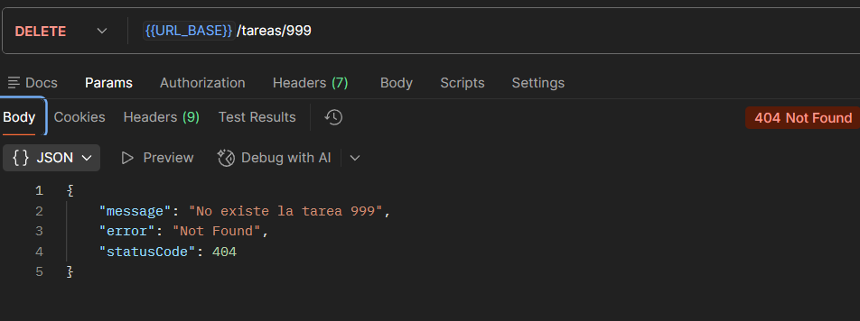

---

### 4.2 Frontend

#### Métodos agregados en `TareasService` (`frontend/src/components/tareas/tareas.service.ts`)
Se incorporaron los métodos HTTP para comunicar la vista con los endpoints correspondientes:
```typescript
actualizar(id: number, titulo: string): Observable<Tarea> {
  return this.http.patch<Tarea>(`${this.apiUrl}/tareas/${id}`, { titulo });
}

eliminar(id: number): Observable<Tarea> {
  return this.http.delete<Tarea>(`${this.apiUrl}/tareas/${id}`);
}
```

#### Modificaciones en `TareasComponent` (`frontend/src/components/tareas/tareas.component.ts`)
* Se agregaron señales reactivas (`signals`):
  * `editandoId = signal<number | null>(null);` para controlar qué tarea está en modo edición.
  * `error = signal<string | null>(null);` para almacenar mensajes de error al usuario.
* Métodos implementados:
  * `empezarEdicion(id: number)`: Habilita el modo edición para la fila seleccionada.
  * `guardar(id: number, titulo: string)`: Invoca a `tareasService.actualizar(...)`. La lista reactiva se actualiza **únicamente cuando el backend responde con éxito** (`next`), sustituyendo el elemento modificado y manteniendo intactas las demás tareas.
  * `eliminar(id: number)`: Invoca a `tareasService.eliminar(...)`. La tarea se remueve de la señal de tareas **únicamente tras la respuesta exitosa** del backend.

#### Manejo de Errores en Frontend:
* Si el backend responde con status `404 Not Found` (por ejemplo, si la tarea fue eliminada por otro usuario o cliente), se activa `manejarError(e)`:
  * Se asigna el mensaje: `"La tarea ya no existe. Se actualizó la lista."`.
  * Se invoca automáticamente a `this.cargar()` para sincronizar y refrescar el estado de la lista con la base de datos.
* Para otros errores de red o servidor, se muestra `"No se pudo completar la operación."`.

#### Plantilla HTML (`frontend/src/components/tareas/tareas.component.html`)
Se añadieron los botones respetando rigurosamente los textos exactos solicitados:
* **Editar**: Activa la vista de edición en la tarea.
* **Guardar**: Envía la actualización del título.
* **Eliminar**: Solicita la eliminación de la tarea.
* Mensaje condicional de error con `@if (error()) { <p class="error">{{ error() }}</p> }`.

##### Evidencias de Interacción en el Frontend:
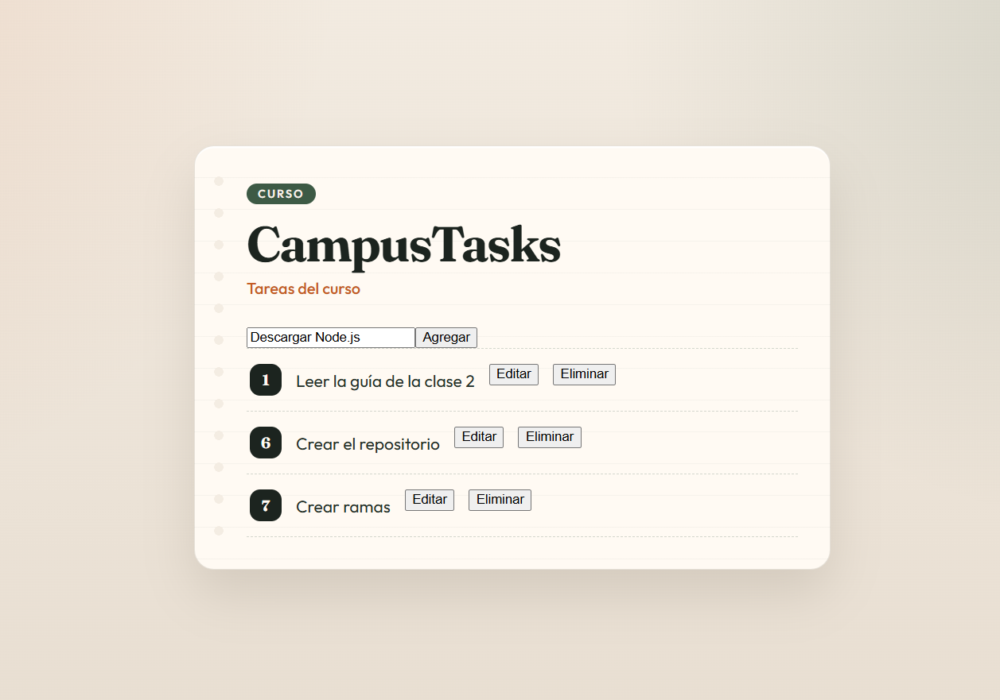
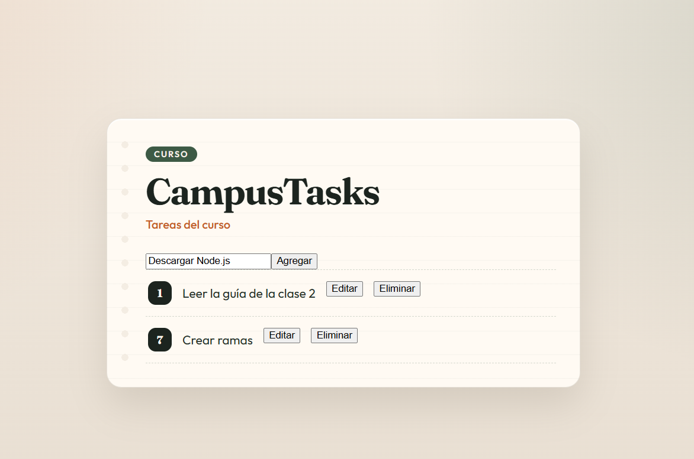

---

## 5. Pruebas Automatizadas

### 5.1 Pruebas del Backend (`npm test` dentro de `backend/`)
Se ejecutaron todas las pruebas unitarias y de integración utilizando Jest:

* **Pruebas Unitarias (`tareas.service.spec.ts`):**
  1. `actualiza el título y devuelve la fila actualizada`: Verifica llamada a `query` con `UPDATE` y retorno de la tarea.
  2. `elimina la tarea y devuelve la fila eliminada`: Verifica llamada a `query` con `DELETE` y retorno de la tarea.
  3. `no concatena el id dentro del texto SQL`: Confirma el uso de `$1` y ausencia de concatenación.
  4. `envía el id como number en los parámetros`: Comprueba el tipo numérico del parámetro.
  5. `devuelve undefined cuando el id no existe`: Comprueba comportamiento con `rows: []`.
  6. `ejecuta una sola consulta al eliminar`: Confirma una única llamada a `query`.
  7. `propaga el error si la base de datos falla`: Verifica manejo de excepciones de BD.
  8. `elimina la tarea correspondiente al id recibido`: Valida que se use el id dinámico.

* **Pruebas de Integración (`tareas.integration.spec.ts`):**
  1. `PATCH /tareas/:id actualiza el título y responde 200`: Comprueba actualización exitosa.
  2. `PATCH /tareas/:id responde 404 si la tarea no existe`: Comprueba respuesta 404 ante `rows: []`.
  3. `DELETE /tareas/:id elimina la tarea y responde 200`: Comprueba eliminación exitosa.
  4. `DELETE /tareas/:id responde 404 si la tarea no existe`: Comprueba 404 ante `rows: []`.
  5. `DELETE /tareas/:id convierte el id de la URL a number`: Verifica que el parámetro se transmita como número.
  6. `DELETE /tareas/:id ejecuta una sola consulta`.
  7. `DELETE /tareas/:id devuelve la tarea eliminada en el cuerpo`.
  8. `DELETE /tareas/:id responde 500 si la base de datos falla`.

* **Resultado de ejecución backend:**
  ```text
  Test Suites: 2 passed, 2 total
  Tests:       20 passed, 20 total
  Snapshots:   0 total
  Time:        17.56 s
  Ran all test suites.
  ```

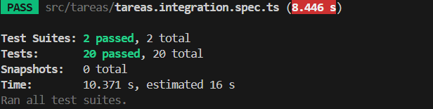

---

### 5.2 Pruebas del Frontend (`npm test` dentro de `frontend/`)
Se ejecutaron las pruebas con Karma y Jasmine:

* **Casos probados (`tareas.component.spec.ts`):**
  1. `muestra el id y el título de cada tarea` (Prueba base conservada).
  2. `agrega la tarea creada al hacer clic en Agregar` (Prueba base conservada).
  3. `edita una tarea al pulsar Editar, escribir y pulsar Guardar`: Simula la interacción completa, valida la invocación al spy con `(id, nuevoTitulo)` y corrobora que el DOM muestre el título actualizado sin afectar a las otras tareas.
  4. `elimina una tarea al pulsar Eliminar y deja las demás`: Simula clic en Eliminar, valida la llamada al spy con `(id)` y comprueba que la tarea desaparece de la vista mientras las restantes permanecen.

* **Resultado de ejecución frontend:**
  ```text
  Chrome 144.0.0.0 (Windows 10): Executed 4 of 4 SUCCESS (0.193 secs / 0.172 secs)
  TOTAL: 4 SUCCESS
  ```

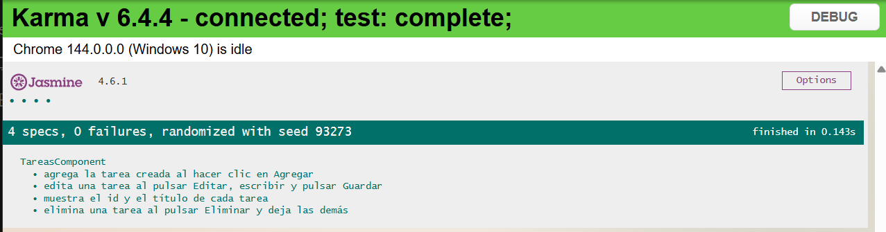

---

## 6. Procedimiento en Git

### 6.1 Comandos Utilizados
1. **Actualización de la rama principal:**
   ```bash
   git checkout master
   git pull origin master
   ```
2. **Creación de la rama de trabajo:**
   ```bash
   git checkout -b taller/actualizar-eliminar-tareas-simon-kSanabria-NicoCastañeda
   ```
3. **Verificación de archivos y exclusión de `.env`:**
   ```bash
   git status
   # Se verifica que backend/.env NO se encuentre en la lista de cambios a comitear
   ```
4. **Registro de commits explicativos:**
   * `c21ca42` — `feat(backend): agrega método actualizar en TareasService con prueba unitaria`
   * `b604119` — `feat(backend): agrega ruta PATCH /tareas/:id con pruebas de integración 200 y 404`
   * `323ff33` — `Agrega método eliminar al servicio de tareas con sus pruebas unitarias`
   * `5e26684` — `Eliminar`
   * `bf650ef` — `fix(backend): elimina función expect generada por error en pruebas de integración`
   * `8f9ba1e` — `feat(frontend): agrega métodos actualizar y eliminar en el servicio HTTP`
   * `9bf0a40` — `feat: implementar edición y eliminación de tareas en la vista`
5. **Publicación de la rama en el repositorio remoto:**
   ```bash
   git push -u origin taller/actualizar-eliminar-tareas-simon-kSanabria-NicoCastañeda
   ```

### 6.2 URL de la Rama
* Rama publicada: `https://github.com/TevenV27/campus-task/tree/taller/actualizar-eliminar-tareas-simon-kSanabria-NicoCasta%C3%B1eda`

---

## 7. Verificación de Criterios de Aceptación (Sección 5)

| Criterio | Estado | Detalle de Verificación |
| :--- | :---: | :--- |
| **1. PostgreSQL y backend/.env** | Cumplido | El backend lee variables de entorno de `backend/.env` y conecta a PostgreSQL. |
| **2. Métodos en TareasService** | Cumplido | `actualizar(id, titulo)` y `eliminar(id)` implementados con SQL parametrizado (`$1`, `$2`). |
| **3. Rutas en TareasController** | Cumplido | `PATCH /tareas/:id` y `DELETE /tareas/:id` responden 200 con la tarea o 404 si no existe. |
| **4. Pruebas unitarias backend** | Cumplido | Cobertura completa de actualización y eliminación con mock de `DatabaseService.query`. |
| **5. Pruebas de integración backend** | Cumplido | Cubren flujos 200 y 404 para ambas rutas mediante `supertest`. |
| **6. npm test pasa en backend** | Cumplido | **20 de 20 pruebas aprobadas** (2 suites passed). |
| **7. Interfaz frontend con Editar y Eliminar** | Cumplido | Botones con etiquetas exactas integrados y funcionales contra el backend. |
| **8. Pruebas de componente frontend** | Cumplido | Casos de edición y eliminación implementados con spy del servicio HTTP. |
| **9. npm test pasa en frontend** | Cumplido | **4 de 4 pruebas aprobadas** en Karma. |
| **10. Rama nueva publicada sin .env** | Cumplido | Rama `taller/actualizar-eliminar-tareas-simon-kSanabria-NicoCastañeda` publicada sin `.env`. |
| **11. Documento ENTREGA en la raíz** | Cumplido | Archivo `ENTREGA.md` generado en la raíz con todas las secciones requeridas. |
